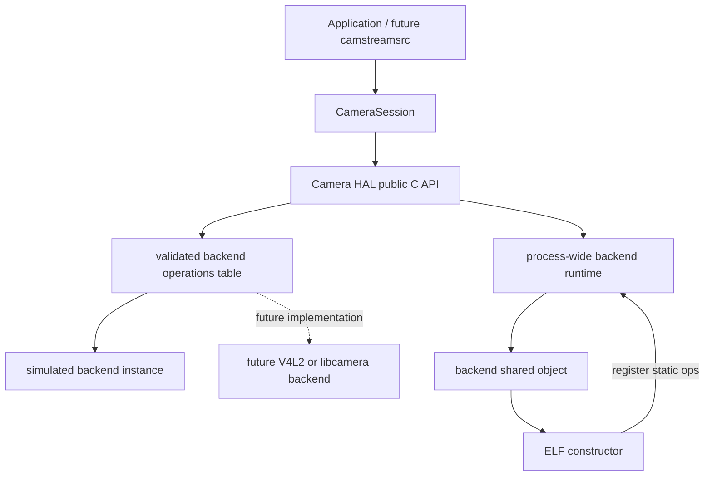

# Camera HAL Design

## Definition and Stage 8.4 boundary

The Camera HAL is the stable platform-porting boundary presented to upper layers. A camera backend is a replaceable
implementation of the HAL backend SPI. Both interfaces are project-owned and platform independent; neither is an
official Linux interface.

Stage 8.4 implements the constructor-registration architecture:

- `libcamstream-camera-hal.so` owns the public C HAL, backend runtime, and C++17 `CameraSession` wrapper;
- a backend module registers one static ABI-v1 operation table from an ELF constructor;
- the HAL validates and retains that registration after `dlopen()` returns;
- upper layers call only the public HAL operations;
- multiple sessions share one loaded backend while retaining separate backend instances and frame ownership.

The Stage 8.3 Camera PPI report remains historical evidence for the lifecycle and ownership behavior migrated here.
Phases 1 and 2 are implemented and owner-validated within their host scope. The closure audit leaves Stage 8.4
**READY FOR OWNER FINAL VALIDATION**; Buildroot and hardware-target validation remain outside this scope.

## Component architecture



The dispatch remains direct and traceable:

```text
camstream_camera_start(camera)
-> camera operations.start(backend instance)
-> simulated_start(backend instance)
```

There is no alternate descriptor-return path and no backend callback access from `CameraSession`.

## Interface separation

### Upper-layer HAL contract

`camera_hal.h` contains the opaque `camstream_camera` handle, C-compatible status and value types, layer-level backend
load/unload functions, and ordinary camera lifecycle/frame operations. It exposes no STL, exceptions, platform device
types, loader handles, or backend instances.

Each ordinary operation validates its HAL arguments, then dispatches directly through the validated operation table.
Backend-specific lifecycle policy remains in the backend; the HAL does not duplicate it.

### Backend SPI

`camera_backend.h` defines the opaque backend instance, mandatory callbacks, ABI-v1 operation table, and
`camstream_camera_hal_register_backend_v1()`. Every callback is mandatory in ABI v1, and no callback may allow a C++
exception to cross the C boundary.

The module-owned descriptor, identity string, and callbacks have static lifetime. Its constructor registers only those
static values. Device access, buffers, threads, streaming state, frame storage, and errors remain per camera instance.

## Backend runtime ownership

`camera_backend_runtime.cpp` owns:

- the module handle and explicit loaded path;
- the validated descriptor and copied backend identity;
- `UNLOADED`, `LOADING`, `LOADED`, `UNLOADING`, and terminal `FAULTED` state;
- client references and live backend-instance count;
- bounded loader diagnostics.

The first client marks the runtime `LOADING`, releases the runtime mutex, then calls `dlopen()`. The module constructor
re-enters the registration hook without deadlocking. After `dlopen()` returns, the first client validates that exactly
one complete descriptor registered and commits `LOADED`. Concurrent clients wait for loading or unloading to finish.

Additional clients requesting the same path increment the runtime reference without expecting the ELF constructor to
run again. A different path is rejected while a backend is active. The last client may unload only after all HAL camera
instances are destroyed; the runtime marks `UNLOADING`, retains module ownership while `dlclose()` runs, and clears its
module and operation state only after close succeeds. A later first client can then load and register the module again.

A failed load, absent constructor registration, invalid descriptor, or duplicate registration closes any temporary
handle and restores `UNLOADED` only after that close succeeds. A close failure preserves module ownership, clears the
callable operation pointer, enters `FAULTED`, and rejects later loads and camera operations rather than exposing stale
callbacks or falsely advertising a reusable runtime.

## CameraSession ownership and lifecycle

`CameraSession` owns one HAL runtime reference, one opaque HAL camera, its lifecycle state, a distinct session identity,
and its outstanding frame tokens. It is non-copyable and non-movable.

The normal lifecycle remains:

```text
load backend -> create HAL camera -> open -> configure -> start
             -> wait -> acquire -> release
             -> stop -> close -> destroy HAL camera -> release backend reference
```

Backend statuses become `CameraError` exceptions above the C boundary. Destruction is non-throwing and performs
best-effort token release, stop, close, HAL camera destruction, and backend-runtime release in that order.

## Frame ownership invariants

The backend owns image storage. `CameraFrame` contains borrowed plane views valid only until successful release. The
wrapper preserves:

- an independent identity for every session;
- cross-session and duplicate release rejection before backend dispatch;
- tracking of every outstanding token;
- acquire rollback if wrapper validation or token tracking fails;
- a pending cleanup token when rollback itself fails;
- frame invalidation only after successful release;
- backend instance destruction before the final module unload.

Numerically equal tokens from separate backend instances do not imply shared ownership.

## Simulated and future backends

The simulated backend retains its four-buffer state machine, fixed 64x48 YUYV configuration at 30/1, deterministic
payload generation, token behavior, diagnostics, and lifecycle. Its ELF constructor only registers the static
descriptor; it does not allocate a camera, open a device, start streaming, or perform frame I/O.

Future backends retain this naming and are not implemented in Stage 8.4:

```text
backends/camera/v4l2/       -> libcamstream-camera-backend-v4l2.so
backends/camera/libcamera/  -> libcamstream-camera-backend-libcamera.so
```
