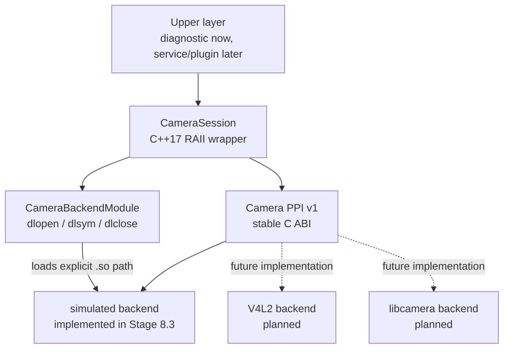

# Camera PPI Design

## Definition and purpose

The Camera PPI is the stable platform-porting contract exposed to upper layers. It separates camera lifecycle and frame
ownership from the API used by a particular camera stack. It is a project interface, not an official Linux standard.

The terms used by this project are:

- **Camera PPI:** stable platform-porting contract exposed to upper layers.
- **Camera backend:** replaceable implementation of the Camera PPI.
- **Simulated backend:** hardware-independent backend used to validate lifecycle and ownership.
- **V4L2 backend:** planned implementation using Linux V4L2 userspace APIs.
- **libcamera backend:** planned implementation using the libcamera API.

The separation allows upper layers to use one lifecycle while each backend keeps its platform-specific handles and
buffer mappings private. Stage 8.3 implements the contract, loader, C++ wrapper, and simulated backend. It does not
implement the planned V4L2 or libcamera backends.

## Component architecture



The core target is `camstream-camera-ppi`, with CMake alias `camstream::camera-ppi`, and is currently configured to
produce `libcamstream-camera-ppi.a`. A camera backend is a separate shared object. The Stage 8.3 implementation is
`libcamstream-camera-backend-simulated.so` and identifies itself as `simulated`.

## Stable C ABI boundary

The public `camera_ppi.h` header uses only C-compatible and fixed-width types. It exposes no STL, exceptions, V4L2,
GStreamer, or libcamera structures. The boundary consists of:

- a versioned backend descriptor;
- an opaque `camstream_camera_instance`;
- fixed-layout stream, capability, plane, and frame structures;
- C-compatible status values;
- mandatory lifecycle callbacks;
- a bounded diagnostic callback;
- the explicit `camstream_camera_get_backend_v1` entry point.

Each extensible ABI structure carries `abi_version` and `struct_size`. The loader requires ABI v1, verifies that the
descriptor is large enough for v1, checks a bounded backend name, and rejects any missing mandatory callback. Output
structures returned by callbacks are validated again before the C++ wrapper uses them.

Reserved fields provide space for compatible evolution, but Stage 8.3 defines no compatibility policy beyond exact ABI
v1 acceptance and minimum v1 structure sizes.

## Dynamic loading and module lifetime

`CameraBackendModule` loads an explicit path with:

```text
dlopen(path, RTLD_NOW | RTLD_LOCAL)
dlsym(handle, "camstream_camera_get_backend_v1")
```

The entry point returns a module-owned descriptor with static lifetime. The module object copies the bounded backend
name for diagnostics but retains the descriptor pointer while the shared object is loaded. A partially validated module
is closed automatically. A valid module remains loaded until its backend instance has been destroyed, preventing calls
through function pointers after `dlclose()`.

There is no constructor-driven registry or implicit global backend search. The caller supplies the backend `.so` path.

## C++17 RAII wrapper

`CameraSession` owns one `CameraBackendModule` and one opaque backend instance. The session is non-copyable and
non-movable so the following resources retain one stable owner:

- the dynamic module handle;
- the validated descriptor;
- the opaque backend instance;
- lifecycle state;
- outstanding frame tokens.

The public wrapper translates callback status values into `CameraError` exceptions with operation, backend, path, and
bounded backend diagnostic context. Exceptions are a C++ convenience above the PPI; no C++ exception may cross the C
ABI. The current API is single-threaded, and callers must serialize operations and destruction.

## Instance lifecycle

The normal lifecycle is:

```text
load -> create -> open -> configure -> start
     -> wait -> acquire -> release
     -> stop -> close -> destroy -> unload
```

The wrapper changes its state only after a callback reports success. Invalid call order is rejected. Repeated `stop()`
after a successful stop and repeated `close()` after a successful close are intentionally harmless cleanup operations.
Destruction is `noexcept` and performs best-effort cleanup after partial initialization.

## Frame ownership

`acquire_frame()` returns a `CameraFrame` containing borrowed plane views and an opaque nonzero token. The backend owns
the plane storage. The caller must not free or modify it, and it remains valid only until the matching
`release_frame(token)` succeeds.

The token is backend-neutral. A future V4L2 backend may map it internally to a V4L2 buffer index; a future libcamera
backend may map it to a request or framebuffer. Those mappings must never cross the PPI. The fixed plane array supports
multiple planes without STL at the ABI boundary, and the token model permits multiple backend buffers to be outstanding.

`CameraSession` records each outstanding token, rejects duplicate tokens, validates plane bounds, and invalidates the
C++ frame view only after successful release.

## Cleanup ordering

Normal cleanup is:

```text
release every acquired frame
-> stop delivery
-> close the source
-> destroy the opaque instance
-> dlclose the backend module
```

Destructor cleanup applies the same ordering on a best-effort basis. Outstanding tokens are released before stop;
`destroy` is still called if an earlier cleanup callback fails. The backend contract requires `destroy` to reclaim its
remaining resources after partial initialization or failed cleanup.

## Simulated and future backends

The simulated backend implements the complete PPI without hardware. It owns four reusable buffers, exposes one fixed
64x48 YUYV configuration at 30/1, generates deterministic bytes, sequence numbers, and monotonic timestamps, and checks
acquire/release ownership. Its purpose is contract and lifecycle validation, not camera-performance simulation.

Future implementations follow the backend naming pattern:

```text
backends/camera/v4l2/       -> libcamstream-camera-backend-v4l2.so
backends/camera/libcamera/  -> libcamstream-camera-backend-libcamera.so
```

Those paths and targets are planned only. They must preserve the PPI boundary and keep all V4L2 or libcamera-specific
objects private to the corresponding backend.
