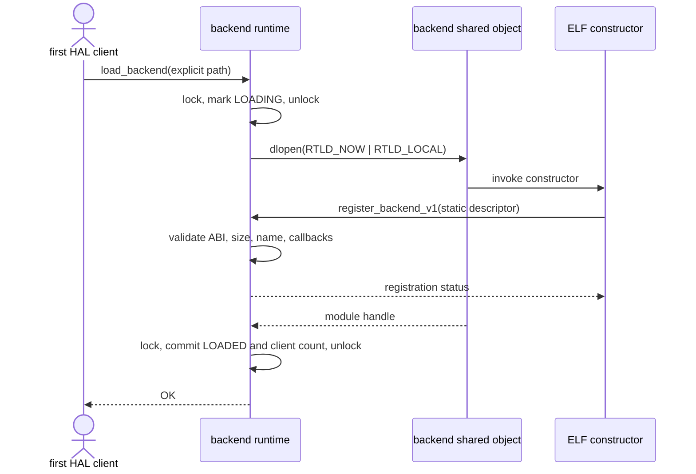
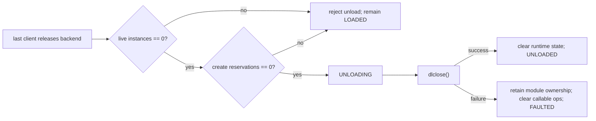
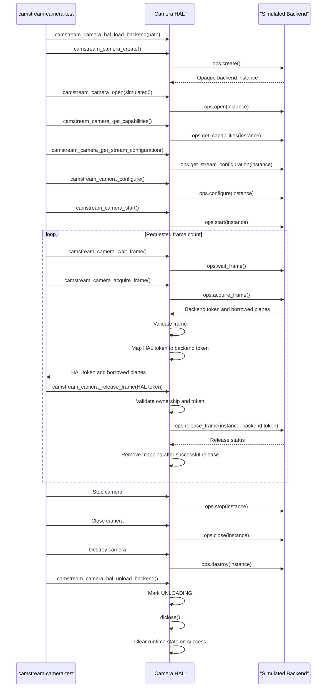

# Camera HAL Runtime Flows

Stage 8.4 routes the finite diagnostic directly through the public Camera HAL and the constructor-registered simulated
backend. Lifecycle and frame-ownership protections live in the HAL core rather than a mandatory C++ wrapper. The
Stage 8.4 architecture is complete within its host-validation scope. Stage 8.5 adds V4L2 backend Phase 1 discovery;
Phase 2 streaming, Buildroot integration, and board validation remain pending.

## Backend load and registration

The runtime mutex is not held across `dlopen()`, because registration re-enters the HAL on the same thread. A concurrent
client waits while state is `LOADING` or `UNLOADING`. Once loaded, another request for the same path increments the
client count; it does not require another constructor invocation. A different path is rejected while the current
backend remains active.

## Final backend unload

The runtime never calls `dlclose()` while a HAL camera instance remains alive or a create reservation is active. A
failed close does not advertise a reusable unloaded state: it preserves the module handle and diagnostic identity,
removes access to backend callbacks, and rejects later loads and camera operations.

## Successful camera lifecycle

## Failure and cleanup behavior

- An invalid or unloadable path fails without creating a camera instance.
- A module that does not register, registers more than once, or supplies an incompatible/incomplete descriptor leaves
  the runtime reusable in `UNLOADED` only when cleanup closes its handle successfully. A close failure enters terminal
  `FAULTED`, preserves module ownership for diagnostics, clears callable operations, and rejects later loads.
- A backend operation failure changes HAL state only after successful dispatch and remains available as a bounded
  backend or HAL diagnostic where applicable.
- A request to unload the final runtime reference while a HAL camera or create reservation is active fails, preserving
  callback-and-destroy-before-`dlclose()` ordering.

Release validates camera state and outstanding public-token membership before dispatch. A cross-camera release
therefore leaves both legitimate frames valid. Equal private backend tokens in two backend instances do not alter
ownership because the HAL exposes process-unique ownership tokens.

If frame validation or token tracking fails after backend acquisition, the HAL attempts immediate rollback. If rollback
also fails, it records one pending backend token, blocks further wait/acquire work, and retries during stop or
destruction. Camera destruction releases pending and outstanding tokens before stop, close, and backend-instance
destruction; module release remains an explicit caller operation after camera destruction.
