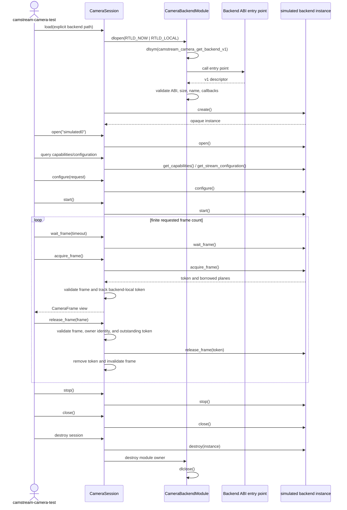
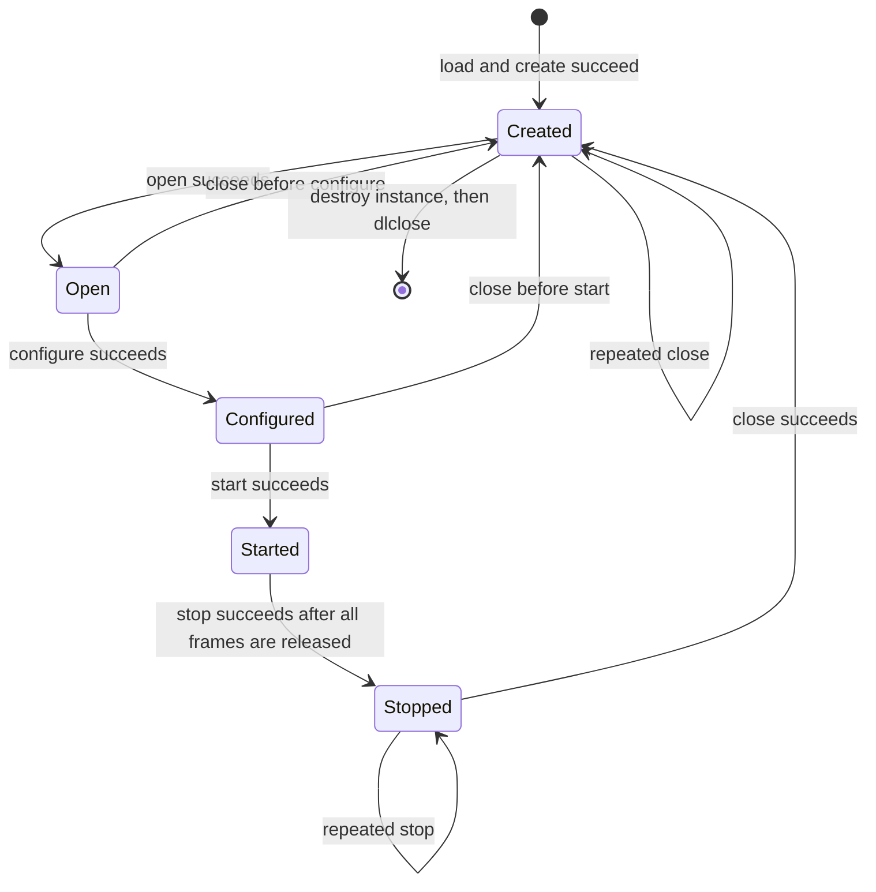

# Stage 8.3 Camera PPI Runtime Flows

Stage 8.3 defines a finite diagnostic flow through `camstream-camera-test`, `CameraSession`, the explicit backend loader,
and the simulated backend. The finite lifecycle and corrective owner-identity and acquire-rollback paths were validated
on the development host. Buildroot and board runtime validation were not performed.

## Successful lifecycle sequence



The loader never reads from an implicit registry. The application supplies the backend path, and the module remains
loaded until the instance is destroyed.

## Actual lifecycle state machine

The C++ session and simulated backend use the same named lifecycle states. The diagram contains only states present in
the implementation.



While `Started`, `wait_frame`, `acquire_frame`, and `release_frame` do not change the lifecycle state. A successful
acquire adds an outstanding token; a successful release removes it. `stop()` rejects outstanding frames during explicit
operation. Destruction is not another public state: it releases known tokens, then attempts stop, close, destroy, and
module unload.

## Failure and cleanup behavior

### Invalid backend path

If `dlopen()` fails, no module owner or backend instance is created. `CameraError` includes the requested path and loader
diagnostic.

### Missing ABI symbol

If `dlsym()` cannot resolve `camstream_camera_get_backend_v1`, the temporary module handle is closed and loading fails.
No callback is invoked.

### Incompatible descriptor

An ABI version mismatch, undersized descriptor, invalid backend name, or missing mandatory callback causes loading to
fail before `create()`. The temporary handle is closed. The loader does not attempt to interpret a different ABI.

### Backend operation failure

The session updates lifecycle state only after a callback succeeds. A callback failure becomes a `CameraError` with the
operation, numeric status, backend identity, path, and bounded last-error text when available. Session destruction then
performs the cleanup appropriate to the last successful state.

### Outstanding frame ownership

After acquire succeeds, the backend owns storage and the session records the backend-instance-local token together with
an independent C++ owner identity. Release follows this order:

```text
validate session state
-> validate frame
-> validate originating session owner identity
-> validate outstanding token
-> backend release
-> remove token and invalidate frame
```

If session B is given a frame from session A, the owner check returns an invalid-argument error before backend B is
called. The supplied frame stays valid, both sessions retain their legitimate outstanding tokens, and each frame can
still be released through its originating session. Equal numeric tokens from two backend instances do not change this
result.

Explicit stop and close reject an unreleased frame. Destructor cleanup walks all recorded tokens, attempts release,
then performs stop, close, destroy, and `dlclose()` in that order. Even when a cleanup callback fails, the module remains
loaded until after `destroy()`.

### Acquire commit and rollback

After a backend returns a frame, the wrapper validates its ABI and metadata, rejects a duplicate token within that
session, and records the token before returning the C++ view. If validation or token-container insertion fails, it
attempts backend release immediately. Successful rollback leaves no tracked token.

If rollback release also fails, the wrapper retains that one token as pending cleanup and reports both the original
commit failure and rollback failure. While the token is unresolved, normal wait/acquire operations are rejected.
Explicit `stop()` retries the pending release, and destructor cleanup retries it before releasing other recorded tokens
and continuing best-effort teardown. No general transaction layer is introduced.
