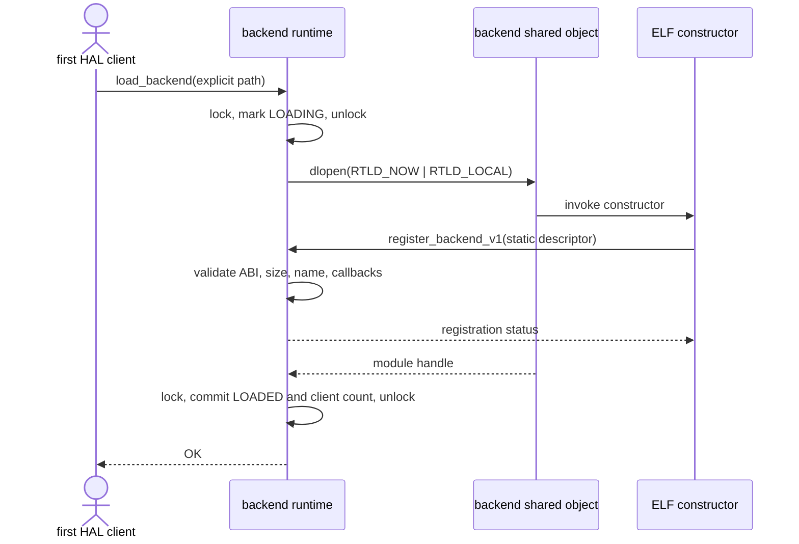
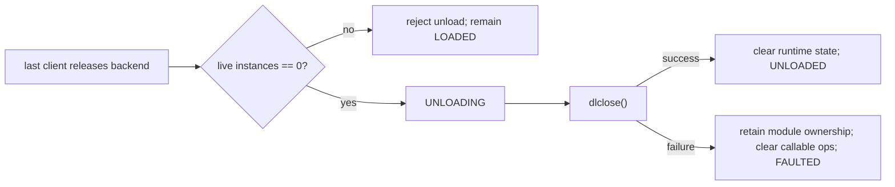
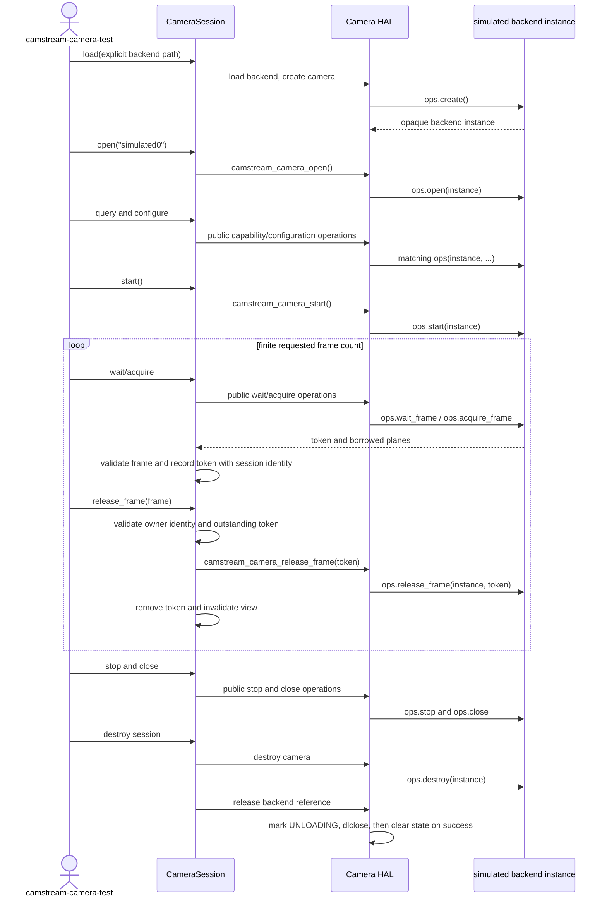

# Camera HAL Runtime Flows

Stage 8.4 routes the finite diagnostic through `CameraSession`, the public Camera HAL, and the constructor-registered
simulated backend. The lifecycle and frame-ownership protections are preserved from the completed Stage 8.3 host
scope. Phases 1 and 2 are implemented and owner-validated within the Stage 8.4 host scope; closure is ready for owner
final validation.

## Backend load and registration

The runtime mutex is not held across `dlopen()`, because registration re-enters the HAL on the same thread. A concurrent
client waits while state is `LOADING` or `UNLOADING`. Once loaded, another request for the same path increments the
client count; it does not require another constructor invocation. A different path is rejected while the current
backend remains active.

## Final backend unload

The runtime never calls `dlclose()` while a HAL camera instance remains alive. A failed close does not advertise a
reusable unloaded state: it preserves the module handle and diagnostic identity, removes access to backend callbacks,
and rejects later loads and camera operations.

## Successful camera lifecycle

## Failure and cleanup behavior

- An invalid or unloadable path fails without creating a camera instance.
- A module that does not register, registers more than once, or supplies an incompatible/incomplete descriptor leaves
  the runtime reusable in `UNLOADED` only when cleanup closes its handle successfully. A close failure enters terminal
  `FAULTED`, preserves module ownership for diagnostics, clears callable operations, and rejects later loads.
- A backend operation failure changes wrapper state only after successful dispatch and includes bounded backend
  diagnostics when available.
- A request to unload the final runtime reference while a HAL camera is alive fails, preserving
  destroy-before-`dlclose()` ordering.

Release validates session state, frame validity, originating session identity, and outstanding-token membership before
dispatch. A cross-session release therefore leaves both legitimate frames valid. Equal numeric tokens in two backend
instances do not alter ownership.

If wrapper validation or token tracking fails after backend acquisition, `CameraSession` attempts immediate rollback.
If rollback also fails, it records one pending cleanup token, blocks further wait/acquire work, and retries during stop
or destruction. Destructor cleanup releases pending and outstanding tokens before stop, close, camera destruction, and
runtime release.
