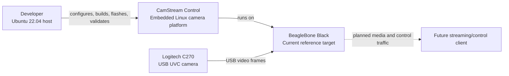
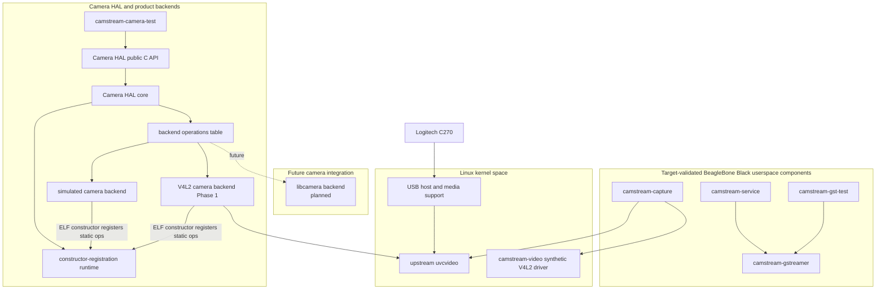

# CamStream Control System Overview

## Purpose

CamStream Control is an Embedded Linux multimedia project for learning and demonstrating reproducible board support,
camera capture, GStreamer pipelines, service lifecycle control, and future network streaming. Correct ownership,
repeatable builds, and evidence from the actual target take priority over unsupported capability claims.

## Current development platform

The current supported reference platform is:

- Ubuntu 22.04 development host;
- BeagleBone Black target booting a project-owned Buildroot 2026.02.3 image;
- U-Boot 2026.01 and Linux 6.18.1;
- Logitech C270 USB UVC camera through the upstream `uvcvideo` driver;
- TP-Link `2357:010c` Wi-Fi adapter through `rtl8xxxu`;
- UART for boot evidence and Ethernet/Wi-Fi for target access.

The BeagleBone Black is the current integration and runtime-validation target. Future CSI-camera work is planned for a
platform with an appropriate CSI receiver and libcamera integration; it is not implemented or validated in the current
tree.

## C4-style System Context Diagram

This is a C4-style context view expressed with a Mermaid flowchart. It is not a UML diagram.



## Software boundaries



Kernel drivers own hardware-facing and V4L2 kernel behavior. Userspace applications own policy, diagnostics, pipeline
control, and process lifecycle. The Camera HAL adds a userspace portability boundary; it does not replace the kernel
V4L2 API or the production C270 path. Its foundation, simulated backend, and diagnostic inherit the host-validated
Stage 8.3 behavior. Stage 8.4 adds the public HAL dispatch and constructor-registration runtime while preserving that
behavior. Stage 8.5 adds the V4L2 backend Phase 1 discovery path without changing the HAL contract. Its Buildroot and
board validation remain deferred, and V4L2 configuration and streaming are not implemented yet.

## Current and planned components

| Component | Responsibility | Status |
| --- | --- | --- |
| `camstream-capture` | Native V4L2 diagnostic capture and frame output | Implemented and target validated |
| `camstream-gst-test` | Finite GStreamer diagnostic pipelines | Implemented and target validated |
| `camstream-service` | Foreground service owning the reusable GStreamer pipeline | Implemented through Stage 8.2 |
| `camstream-gstreamer` | Shared GStreamer pipeline implementation | Implemented through Stage 8.2 |
| `camstream-video` | Synthetic kernel V4L2 capture driver | Implemented and target validated |
| `camstream-camera-hal` | Shared Camera HAL contract, constructor-registration runtime, lifecycle/frame ownership, and public status-based dispatch | Complete within the documented Stage 8.4 host scope |
| simulated camera backend | Hardware-independent Camera HAL backend | Owner-validated in host scope; not target validated |
| `camstream-camera-test` | Finite Camera HAL lifecycle diagnostic | Owner-validated in host scope; not target validated |
| V4L2 camera backend | Camera HAL backend using Linux V4L2 userspace APIs | Stage 8.5 Phase 1 implemented; Phase 2, Buildroot, and board validation pending |
| libcamera camera backend | Camera HAL backend using libcamera | Planned, not implemented |
| IPC and network streaming | External control and production media delivery | Planned |

## Camera paths

The current USB production-oriented path remains:

```text
Logitech C270 -> USB -> uvcvideo -> V4L2 -> GStreamer -> camstream-service
```

The Stage 8.4 hardware-independent diagnostic path is:

```text
camstream-camera-test -> Camera HAL -> backend operations -> simulated backend
```

The Stage 8.5 V4L2 portability path places Phase 1 device and configuration discovery behind the same Camera HAL:

```text
camstream-camera-test -> Camera HAL -> backend operations -> V4L2 backend -> Linux V4L2
```

V4L2 format application, MMAP, streaming, and frame delivery remain Phase 2 work. A future CSI path may use a planned
libcamera backend. The simulated and V4L2 modules register static operation tables through ELF constructors; device
and capture resources remain per instance. `CameraSession` and `CameraError` are not part of the active architecture.

## Repository structure

```text
apps/                              Project-owned userspace applications
backends/camera/simulated/         Simulated Camera HAL backend
backends/camera/v4l2/              V4L2 Camera HAL backend
br2-external/                      Buildroot BR2_EXTERNAL integration
docs/                              Architecture, development, guides, validation
drivers/                           Project-owned Linux kernel drivers
libs/camstream-camera-hal/         Camera HAL contract, backend SPI, runtime, lifecycle, and dispatch
libs/camstream-gstreamer/          Reusable GStreamer pipeline library
scripts/                           Host and target helper scripts
```

Generated source trees, Buildroot output, binaries, modules, images, credentials, and private runtime evidence remain
outside Git.
